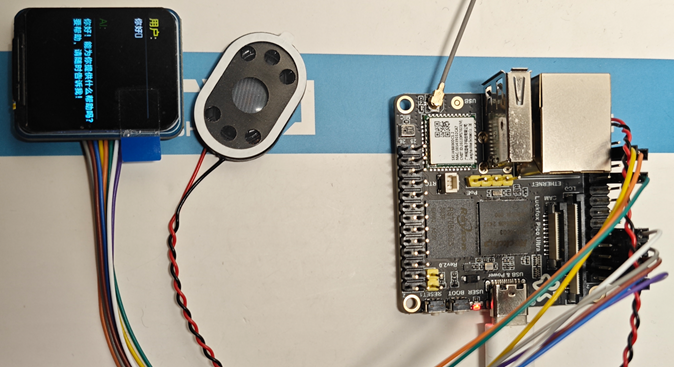

# EdgeVoice

## 项目说明

EdgeVoice 是一个使用 Azure OpenAI Realtime API 实现的一个 AI 聊天机器人。



## 使用说明

### 硬件配置

- Linux 开发板（树莓派、Luckfox、Jetson Nano 等）
- 麦克风
- 扬声器
- 显示屏（可选）

### 系统配置

- 安装 .NET 8.0 及以上 SDK
- 扬声器和麦克风接入系统声卡
- 安装 `libasound2-dev` 库

```bash
sudo apt-get install libasound2-dev
```

### 相关技术文章

以下的开源项目和文章可以帮助你更好的理解 EdgeVoice 的实现原理以及如何接入使用：

- [纯前端使用 Azure OpenAI Realtime API 打造语音助手](https://mp.weixin.qq.com/s/sNsFJaYYP1Zjf47MRRrytw)
- [在Linux开发板中使用.NET实现音频开发](https://mp.weixin.qq.com/s/IqV0U1g_C0QrZLeOMRDX_g)
- [让屏幕动起来：使用.NET玩转NV3030B驱动](https://mp.weixin.qq.com/s/u0QxCqKDMjsueIXr_tCPRg)
- [WssRealtimeAPI](https://github.com/sangyuxiaowu/WssRealtimeAPI?wt.mc_id=DT-MVP-5005195)
- [NV3030B的.NET 驱动](https://github.com/sangyuxiaowu/NV3030B?wt.mc_id=DT-MVP-5005195)
- [Linux 开发板接入OpenAI 实时语音聊天实战](https://mp.weixin.qq.com/s/3DJFpf-EUKzTMl-Z4-w9RA)
- [在Luckfox上使用EdgeVoice语音助手](https://mp.weixin.qq.com/s/QNLgislFnzevWvhWC74wRQ)

## 发布

```bash
dotnet publish ./src/EdgeVoice.csproj -r linux-arm -p:PublishSingleFile=true -f net9.0 --self-contained=false -o ./publish/linux-arm
```

- 树莓派需要修改 `linux-arm` 为 `linux-arm64`
- 如果需要框架依赖，删除 `--self-contained=false` 参数即可
- 使用的库 Alsa 不支持 Windows，所以 Windows 下无法运行

本项目 Release 提供了框架依赖的版本，可以直接下载使用。需要安装 .NET 9.0 运行时。可使用  `doc\install_dotnet_sdk_9.sh` 脚本安装。

## 接入 Azure OpenAI Realtime API

- 前往[Azure AI Foundry](https://oai.azure.com/?wt.mc_id=DT-MVP-5005195)部署实时音视频资源
- 配置 `appsettings.json` 中的 `AzureOpenAIRealtimeApi` 节点
- 无显示屏则将 `LcdSettings` 节点的 `SpiBus` 设置为 `-1` 即可
- 运行程序即可
